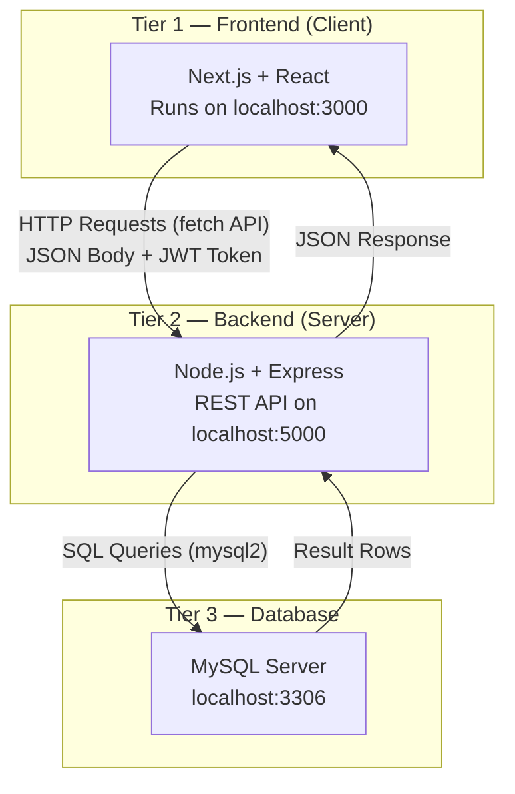
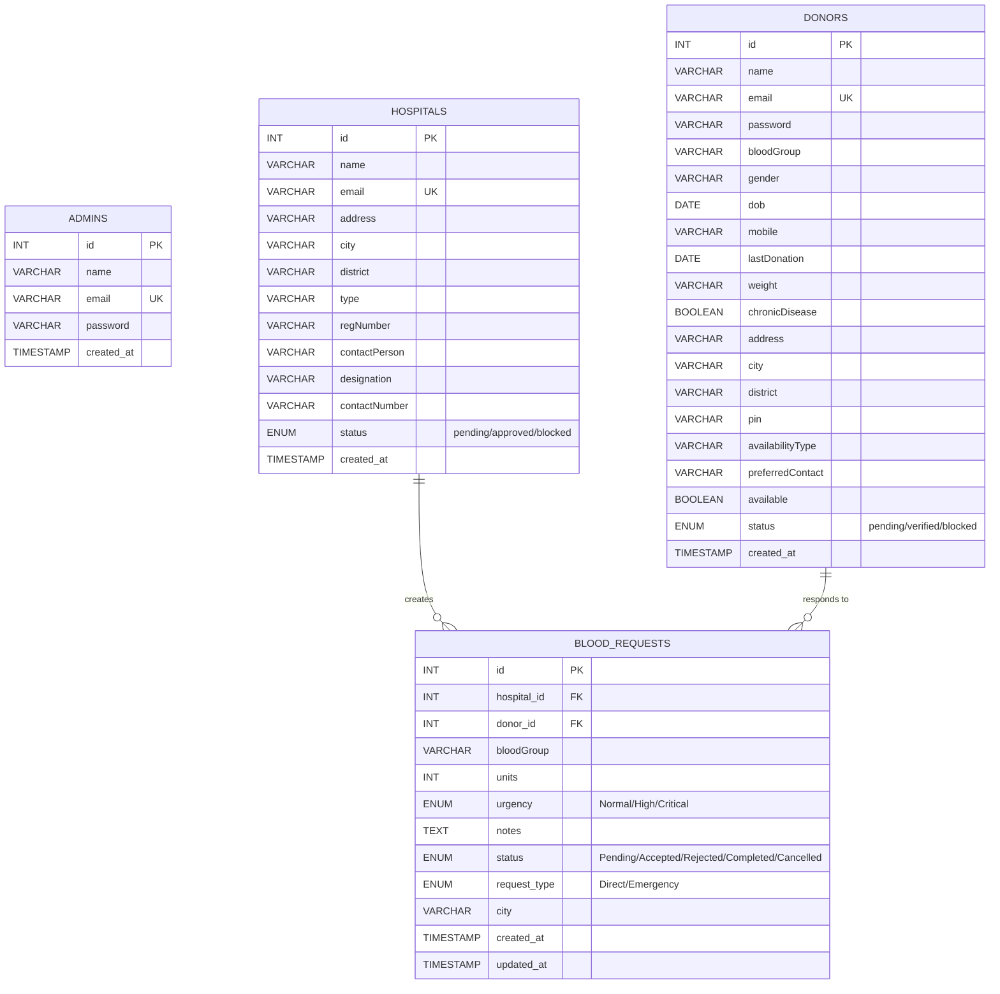
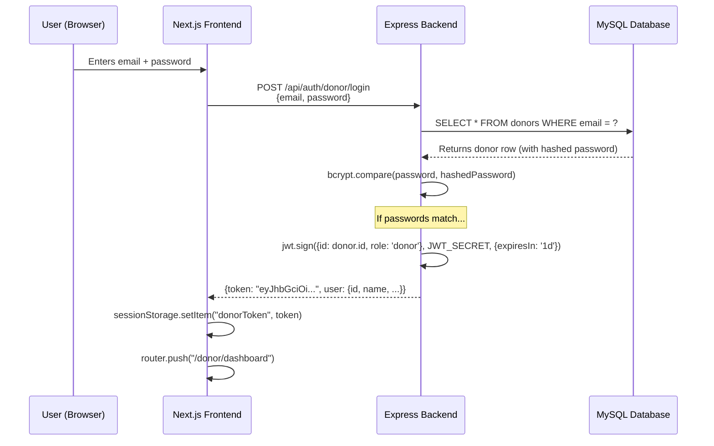
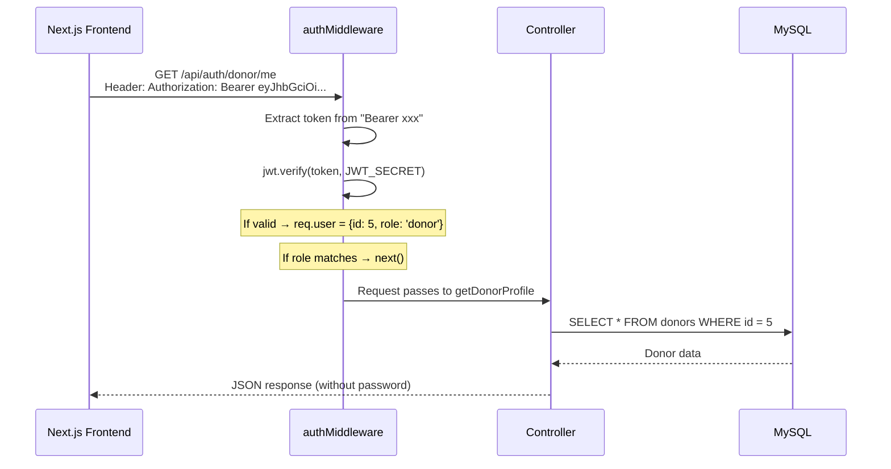
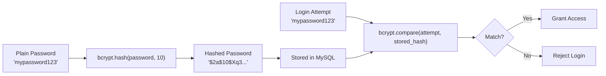
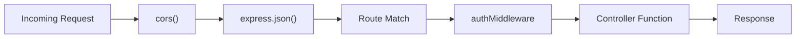
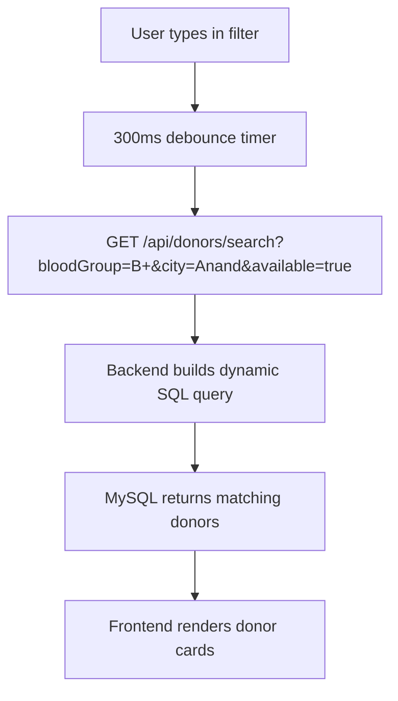

# 🩸 Blood Donor Finder — Complete Viva Preparation Guide

---

## 1. Project Overview

**Blood Donor Finder** is a full-stack web application that connects blood donors with hospitals during emergencies. It provides three role-based dashboards:

| Role | What They Can Do |
|------|-----------------|
| **Donor** | Register, login, manage profile, toggle availability, accept/reject blood requests |
| **Hospital** | Register (pending admin approval), login, search donors, create blood requests (Direct or Emergency) |
| **Admin** | Login, verify/block donors, approve/block hospitals, view platform stats |

---

## 2. System Architecture (Three-Tier)



> [!IMPORTANT]
> **Three-Tier Architecture** means we separate the Presentation layer (Next.js), Business Logic layer (Express API), and Data layer (MySQL). This makes the system modular — you can change the frontend without touching the backend, or swap MySQL for PostgreSQL without changing the React code.

---

## 3. Technology Stack & Why Each Was Chosen

### 3.1 Frontend — Next.js (React framework)

| Technology | Version | Why We Chose It |
|-----------|---------|-----------------|
| **Next.js** | 16.x | File-based routing (`app/donor/login/page.tsx` automatically becomes the `/donor/login` URL). Also gives us Server-Side Rendering (SSR) and Static Site Generation (SSG) for better SEO and performance. |
| **React** | 19.x | Component-based UI library. We break the UI into reusable pieces (`<Navbar/>`, `<Footer/>`, `<DonorSearch/>`). Uses Virtual DOM for efficient re-rendering. |
| **TypeScript** | 5.7 | Adds static type-checking on top of JavaScript. Catches bugs at compile time (e.g., passing a `string` where a `number` is expected). |
| **TailwindCSS** | 4.x | Utility-first CSS framework. Instead of writing separate `.css` files, we write classes directly in JSX: `className="rounded-2xl bg-card p-6"`. Faster development, consistent design. |
| **Radix UI** | Various | Pre-built accessible UI components (Dialog, Select, Tabs, etc.). We use the `shadcn/ui` library which wraps Radix with TailwindCSS styling. |
| **Lucide React** | 0.564 | Icon library. Provides `<Heart/>`, `<Building2/>`, `<Search/>`, etc. |
| **React Hook Form + Zod** | 7.x / 3.x | Form handling and validation. Zod defines validation schemas, React Hook Form manages form state efficiently without re-rendering the entire form. |
| **Recharts** | 2.15 | Chart library for the admin dashboard analytics. |

**Why Next.js over plain React (Create React App)?**
- **File-based routing**: No need for `react-router-dom`. Just create `app/donor/login/page.tsx` and it works.
- **Server Components**: Some pages render on the server = faster initial paint.
- **Built-in optimization**: Image optimization, font optimization (we load Inter and Space_Grotesk via `next/font/google`).
- **SEO-friendly**: HTML is generated on the server, so search engines can index it.

---

### 3.2 Backend — Node.js + Express

| Technology | Version | Why We Chose It |
|-----------|---------|-----------------|
| **Node.js** | Runtime | JavaScript runtime built on Chrome's V8 engine. Allows us to write both frontend and backend in the same language (JavaScript). Non-blocking I/O makes it fast for handling many concurrent requests. |
| **Express** | 5.x | Minimal, flexible web framework. Provides routing (`app.get()`, `app.post()`), middleware support, and easy JSON handling. |
| **bcryptjs** | 3.x | Password hashing library. Converts plain passwords into irreversible hashes using the bcrypt algorithm with salt rounds. |
| **jsonwebtoken (JWT)** | 9.x | Creates and verifies JSON Web Tokens for stateless authentication. |
| **mysql2** | 3.x | MySQL client for Node.js. Supports Promises (`async/await`) unlike the older `mysql` package. Provides connection pooling. |
| **cors** | 2.8 | Enables Cross-Origin Resource Sharing. Since frontend (port 3000) and backend (port 5000) are on different origins, browsers would block requests without CORS. |
| **dotenv** | 17.x | Loads environment variables from `.env` file into `process.env`. Keeps secrets (DB password, JWT secret) out of source code. |

**Why Node.js over Python/Java?**
- **Single language**: JavaScript on both frontend and backend = less context switching.
- **Non-blocking I/O**: Node uses an event loop, not threads. It can handle thousands of concurrent connections without creating a thread per connection.
- **NPM ecosystem**: The largest package registry in the world. Easy to find libraries for any task.
- **Fast JSON handling**: Since JavaScript natively understands JSON, there's no serialization overhead.

**Why Express over other frameworks (Fastify, Koa, NestJS)?**
- **Simplicity**: Express is the most popular Node framework with the largest community.
- **Minimal boilerplate**: You can set up a full API server in ~30 lines of code.
- **Middleware pattern**: Easy to add authentication, logging, error handling as layers.

---

### 3.3 Database — MySQL

| Feature | Why MySQL |
|---------|-----------|
| **Relational (SQL)** | Our data has clear relationships: a hospital creates blood_requests, a donor accepts them. SQL handles these relationships naturally with FOREIGN KEYs. |
| **ACID compliant** | Atomicity, Consistency, Isolation, Durability. Critical for healthcare data — we need guarantees that a blood request won't be half-written. |
| **Widely used** | Most popular open-source RDBMS. Excellent community support. |
| **Structured data** | Our entities (donors, hospitals, admins, blood_requests) have fixed schema — perfect for a relational DB. |

**Why MySQL over MongoDB?**
- MongoDB is NoSQL (document-based). It's great for unstructured data, but our data is highly structured with clear relationships between donors, hospitals, and requests.
- SQL JOINs (e.g., joining `blood_requests` with `donors` and `hospitals`) are built-in in MySQL but require manual handling in MongoDB.

---

## 4. Database Design (ER Diagram)



### Table Relationships:
- `blood_requests.hospital_id` → **FOREIGN KEY** referencing `hospitals.id` (with `ON DELETE CASCADE`)
- `blood_requests.donor_id` → **FOREIGN KEY** referencing `donors.id` (with `ON DELETE CASCADE`)
- **CASCADE** means: if a hospital is deleted, all its blood requests are automatically deleted too.

---

## 5. Backend Architecture (MVC Pattern)

```
backend/
├── server.js           ← Entry point: creates Express app, registers routes
├── .env                ← Environment variables (secrets)
├── config/
│   └── db.js           ← MySQL connection pool + table initialization
├── middleware/
│   └── authMiddleware.js  ← JWT verification + role-based access control
├── controllers/
│   ├── authController.js  ← Login/Register/Profile logic
│   ├── adminController.js ← Admin dashboard stats, donor/hospital management
│   └── requestController.js ← Blood request CRUD operations
└── routes/
    ├── authRoutes.js    ← Maps URLs to auth controller functions
    ├── adminRoutes.js   ← Maps URLs to admin controller functions  
    ├── donorRoutes.js   ← Donor search + availability toggle
    └── requestRoutes.js ← Blood request endpoints
```

### MVC Breakdown:
- **Model**: The MySQL tables (donors, hospitals, admins, blood_requests). We interact with them via SQL queries in controllers.
- **View**: The React frontend (Next.js pages and components).
- **Controller**: The controller files that contain the business logic.

---

## 6. How JWT Authentication Works (Step-by-Step)

> [!TIP]
> **JWT = JSON Web Token.** It's a stateless authentication mechanism. "Stateless" means the server doesn't store sessions — all the info is inside the token itself.

### 6.1 Token Structure

A JWT has 3 parts separated by dots: `xxxxx.yyyyy.zzzzz`

```
Header.Payload.Signature
```

| Part | Content | Example |
|------|---------|---------|
| **Header** | Algorithm + token type | `{"alg": "HS256", "typ": "JWT"}` |
| **Payload** | User data (claims) | `{"id": 5, "role": "donor", "iat": 1711900000, "exp": 1711986400}` |
| **Signature** | Verification hash | `HMACSHA256(header + "." + payload, JWT_SECRET)` |

### 6.2 Login Flow (Complete Walkthrough)



### 6.3 Authenticated Request Flow



### 6.4 Key Code: How Token is Created

```javascript
// In authController.js (line 77)
const token = jwt.sign(
  { id: donor.id, role: 'donor' },   // Payload — data stored inside token
  process.env.JWT_SECRET || 'secret', // Secret key — used to sign the token
  { expiresIn: '1d' }                // Expires in 1 day
);
```

### 6.5 Key Code: How Token is Verified

```javascript
// In authMiddleware.js (lines 10-16)
const authHeader = req.headers.authorization;   // "Bearer eyJhbGciOi..."
const token = authHeader.split(' ')[1];         // Extract just the token
const decoded = jwt.verify(token, process.env.JWT_SECRET); // Verify + decode
req.user = decoded;  // Now req.user = { id: 5, role: 'donor' }
```

### 6.6 Role-Based Access Control (RBAC)

```javascript
// In authMiddleware.js (line 20)
if (roles.length && !roles.includes(decoded.role)) {
  return res.status(403).json({ error: 'You do not have permission...' });
}
```

Usage in routes:
```javascript
authMiddleware('donor')     // Only donors can access
authMiddleware('hospital')  // Only hospitals can access
authMiddleware('admin')     // Only admins can access
```

### 6.7 Where is the Token Stored on the Client?

```javascript
// In donor/login/page.tsx (line 51-52)
sessionStorage.setItem("donorToken", data.token);
sessionStorage.setItem("donorUser", JSON.stringify(data.user));
```

- **sessionStorage** (not localStorage) → Token is automatically cleared when the browser tab is closed = more secure.
- Old localStorage keys are explicitly removed to prevent session conflicts.

---

## 7. Password Hashing with bcrypt

> [!WARNING]
> **Passwords are NEVER stored in plain text.** They are hashed using bcrypt before being saved to the database.

### How Hashing Works:



### Key Points for Viva:
- **`bcrypt.hash(password, 10)`**: The `10` is the **salt rounds** (cost factor). Higher = slower = more secure. 10 rounds ≈ 10 hashes/sec.
- **Salt**: A random string added to the password before hashing. Prevents rainbow table attacks. bcrypt generates salt automatically.
- **One-way**: You can NEVER convert a hash back to the original password.
- **bcrypt.compare()** does NOT decrypt. It hashes the login attempt with the same salt extracted from the stored hash, then compares the two hashes.

---

## 8. Complete API Endpoints

### 8.1 Authentication Routes (`/api/auth`)

| Method | Endpoint | Auth Required | Description |
|--------|----------|:---:|-------------|
| `POST` | `/api/auth/donor/register` | ❌ | Register a new donor |
| `POST` | `/api/auth/donor/login` | ❌ | Donor login → returns JWT |
| `GET` | `/api/auth/donor/me` | 🔒 Donor | Get logged-in donor's profile |
| `PUT` | `/api/auth/donor/me` | 🔒 Donor | Update donor profile |
| `POST` | `/api/auth/hospital/register` | ❌ | Register a new hospital |
| `POST` | `/api/auth/hospital/login` | ❌ | Hospital login → returns JWT |
| `GET` | `/api/auth/hospital/me` | 🔒 Hospital | Get logged-in hospital's profile |
| `PUT` | `/api/auth/hospital/me` | 🔒 Hospital | Update hospital profile |
| `POST` | `/api/auth/admin/login` | ❌ | Admin login → returns JWT |

### 8.2 Admin Routes (`/api/admin`) — All require Admin auth

| Method | Endpoint | Description |
|--------|----------|-------------|
| `GET` | `/api/admin/stats` | Dashboard statistics (total donors, hospitals) |
| `GET` | `/api/admin/donors` | List all donors with full details |
| `PUT` | `/api/admin/donors/:id/status` | Change donor status (verified/blocked/pending) |
| `GET` | `/api/admin/hospitals` | List all hospitals |
| `PUT` | `/api/admin/hospitals/:id/status` | Change hospital status (approved/blocked/pending) |

### 8.3 Donor Routes (`/api/donors`)

| Method | Endpoint | Auth Required | Description |
|--------|----------|:---:|-------------|
| `GET` | `/api/donors/search` | ❌ Public | Search donors by blood group, city, availability |
| `PUT` | `/api/donors/availability` | 🔒 Donor | Toggle own availability on/off |

### 8.4 Request Routes (`/api/requests`)

| Method | Endpoint | Auth Required | Description |
|--------|----------|:---:|-------------|
| `POST` | `/api/requests` | 🔒 Hospital | Create blood request (Direct or Emergency) |
| `GET` | `/api/requests/hospital` | 🔒 Hospital | Get hospital's own request history |
| `GET` | `/api/requests/donor` | 🔒 Donor | Get requests relevant to the donor |
| `PUT` | `/api/requests/:id` | 🔒 Donor | Accept/Reject a blood request |
| `DELETE` | `/api/requests/:id` | 🔒 Hospital | Delete a blood request |

---

## 9. MySQL Connection Pool

```javascript
// In config/db.js (lines 5-13)
const pool = mysql.createPool({
  host: process.env.DB_HOST,         // localhost
  user: process.env.DB_USER,         // root
  password: process.env.DB_PASSWORD, // from .env
  database: process.env.DB_NAME,     // blood_donor_finder
  waitForConnections: true,          // Queue requests if all connections busy
  connectionLimit: 10,               // Max 10 simultaneous connections
  queueLimit: 0                      // Unlimited queue (0 = no limit)
});
```

### Why Connection Pool (not single connection)?
- A **single connection** can only handle one query at a time. If 50 users hit the API simultaneously, 49 would have to wait.
- A **connection pool** pre-creates 10 connections. When a request comes in, it borrows a connection, runs the query, and returns it. This allows **10 concurrent database operations**.
- Think of it like a bank with 10 tellers vs. 1 teller — much faster throughput.

---

## 10. Frontend Architecture

```
app/                            ← Next.js App Router (file-based routing)
├── layout.tsx                  ← Root layout (fonts, metadata, <html> wrapper)
├── page.tsx                    ← Home page (/)
├── globals.css                 ← Global styles + TailwindCSS imports
├── dashboard/page.tsx          ← Role selection portal (/dashboard)
├── find-donor/page.tsx         ← Public donor search (/find-donor)
├── register-donor/page.tsx     ← Donor registration (/register-donor)
├── hospital-signup/page.tsx    ← Hospital registration (/hospital-signup)
├── donor/
│   ├── login/page.tsx          ← Donor login (/donor/login)
│   └── dashboard/page.tsx      ← Donor dashboard (/donor/dashboard)
├── hospital/
│   ├── login/page.tsx          ← Hospital login (/hospital/login)
│   └── dashboard/page.tsx      ← Hospital dashboard (/hospital/dashboard)
└── admin/
    ├── page.tsx                ← Admin login (/admin)
    └── dashboard/page.tsx      ← Admin panel (/admin/dashboard)

components/                     ← Reusable UI Components
├── navbar.tsx                  ← Navigation bar
├── footer.tsx                  ← Footer
├── donor-registration-form.tsx ← Multi-step donor registration form
├── donor-search.tsx            ← Donor search with filters
├── hospital-signup-form.tsx    ← Hospital registration form
├── hospital-dashboard.tsx      ← Hospital dashboard component
├── admin-panel.tsx             ← Admin dashboard with tabs
├── admin-login-form.tsx        ← Admin login form
├── landing/                    ← Landing page sections
│   ├── hero-section.tsx
│   ├── how-it-works.tsx
│   ├── features-section.tsx
│   ├── impact-section.tsx
│   ├── blood-compatibility.tsx
│   └── cta-section.tsx
└── ui/                         ← shadcn/ui base components (Button, Input, etc.)
```

### Key React Concepts Used:

| Concept | Where Used | Explanation |
|---------|-----------|-------------|
| **`"use client"`** | Top of interactive pages | Marks component as a Client Component (runs in the browser). Required for `useState`, `useEffect`, event handlers. |
| **`useState`** | Login forms, search filters | React hook to create reactive state variables. When state changes, the component re-renders. |
| **`useEffect`** | Data fetching | Runs side-effects (API calls) after the component mounts or when dependencies change. |
| **`useRouter`** | After login | Programmatic navigation: `router.push("/donor/dashboard")` |
| **`useSearchParams`** | DonorSearch | Reads URL query parameters: `?bloodGroup=B+` |
| **`fetch()`** | All API calls | Browser's built-in HTTP client. We use it to call our Express API. |
| **`sessionStorage`** | Token storage | Browser storage that persists only for the current tab session. |

---

## 11. Complete Data Flow Example: Donor Login

Here's what happens step-by-step when a donor logs in:

### Step 1: User fills the form
```
donor/login/page.tsx → useState stores email and password
```

### Step 2: Form submission triggers fetch
```javascript
const res = await fetch("http://localhost:5000/api/auth/donor/login", {
  method: "POST",
  headers: { "Content-Type": "application/json" },
  body: JSON.stringify({ email, password }),
});
```

### Step 3: Express receives the request
```
server.js → app.use('/api/auth', authRoutes)
authRoutes.js → router.post('/donor/login', authController.loginDonor)
```

### Step 4: Controller queries MySQL
```javascript
const [rows] = await pool.query('SELECT * FROM donors WHERE email = ?', [email]);
// Parameterized query prevents SQL injection!
```

### Step 5: Password verification
```javascript
const isMatch = await bcrypt.compare(password, donor.password);
// Compare plain text input with stored hash
```

### Step 6: Token creation
```javascript
const token = jwt.sign(
  { id: donor.id, role: 'donor' },
  process.env.JWT_SECRET,
  { expiresIn: '1d' }
);
```

### Step 7: Response sent back
```javascript
res.json({ message: 'Login successful', token, user: donor });
// Note: password is deleted from the donor object before sending
```

### Step 8: Frontend stores token and redirects
```javascript
sessionStorage.setItem("donorToken", data.token);
router.push("/donor/dashboard");
```

---

## 12. Security Measures

| Security Feature | Implementation | Why |
|-----------------|----------------|-----|
| **Password Hashing** | bcrypt with 10 salt rounds | Even if DB is hacked, passwords can't be reversed |
| **JWT Authentication** | Token-based, stateless | No server-side session storage needed |
| **Token Expiry** | `expiresIn: '1d'` | Limits damage if a token is stolen |
| **Parameterized Queries** | `WHERE email = ?` (not string concatenation) | **Prevents SQL injection attacks** |
| **CORS** | `app.use(cors())` | Controls which origins can call the API |
| **Input Validation** | Checks in controllers (email format, password length) | Prevents malformed data from entering DB |
| **Role-Based Access** | Middleware checks `decoded.role` | Donors can't access admin routes, etc. |
| **Password Removal** | `delete donor.password` before response | Password hash never sent to the client |
| **Environment Variables** | `.env` file + `dotenv` | Secrets not hardcoded in source code |
| **sessionStorage** | Instead of localStorage | Token cleared when tab closes = more secure |

---

## 13. Middleware Explained



| Middleware | Purpose |
|-----------|---------|
| **`cors()`** | Adds `Access-Control-Allow-Origin` headers. Without it, the browser blocks requests from `localhost:3000` to `localhost:5000`. |
| **`express.json()`** | Parses incoming JSON request bodies. Without it, `req.body` would be `undefined`. |
| **`authMiddleware(role)`** | Verifies JWT token and checks if user has the required role. Attaches `req.user` for controllers to use. |

---

## 14. How the Donor Search Works

The **Find Donor** page (`/find-donor`) uses a debounced search pattern:



### Backend SQL (Dynamic Query Building):
```sql
SELECT id, name, bloodGroup, city, district, lastDonation, mobile,
       CASE WHEN lastDonation IS NULL OR DATEDIFF(CURDATE(), lastDonation) >= 90 
            THEN 1 ELSE 0 END AS eligible
FROM donors 
WHERE status = 'verified' AND available = 1
  AND bloodGroup = 'B+'
  AND (city LIKE '%Anand%' OR district LIKE '%Anand%')
  AND (lastDonation IS NULL OR DATEDIFF(CURDATE(), lastDonation) >= 90)
```

> [!NOTE]
> The **90-day rule**: A donor is only shown as "eligible" if their last donation was more than 90 days ago (or they've never donated). This follows medical guidelines that a person should wait at least 3 months between blood donations.

---

## 15. Blood Request Types

| Type | How It Works |
|------|-------------|
| **Direct** | Hospital sends a request directly to a specific donor (by donor_id). Only that donor sees it. |
| **Emergency** | Hospital broadcasts to ALL donors matching the required blood group in the same city. Any matching donor can accept it. When a donor accepts, their `donor_id` is assigned to the request. |

---

## 16. Database Initialization (Auto-Setup)

When the server starts (`server.js` calls `initDB()`), it:

1. **Creates the database** if it doesn't exist: `CREATE DATABASE IF NOT EXISTS blood_donor_finder`
2. **Creates all 4 tables** if they don't exist (`CREATE TABLE IF NOT EXISTS ...`)
3. **Seeds a default admin** if no admin exists: `admin@bloodlink.in` / `admin@123`
4. **Adds missing columns** for backward compatibility

This means a brand-new machine just needs MySQL running — the app creates everything automatically.

---

## 17. Likely Viva Questions & Answers

### Q1: What is the difference between authentication and authorization?
**Authentication** = Verifying WHO the user is (login with email/password → get JWT token).  
**Authorization** = Verifying WHAT the user can do (authMiddleware checks if your role is 'admin' before allowing access to admin routes).

### Q2: Why use JWT instead of sessions?
- **Stateless**: Server doesn't need to store session data. The token carries all info.
- **Scalable**: Works across multiple servers without shared session storage.
- **Mobile-friendly**: Tokens can be stored on any client (web, mobile, desktop).
- **Session-based** would require server-side storage (database or in-memory like Redis), adding complexity.

### Q3: What happens when the JWT expires?
The `authMiddleware` catches `TokenExpiredError` and returns `401 - Session expired. Please log in again.` The user is redirected to the login page.

### Q4: What is SQL injection and how do you prevent it?
SQL injection is when a hacker inserts malicious SQL through user inputs. Example: entering `' OR 1=1 --` as email.  
**Prevention**: We use **parameterized queries** (`WHERE email = ?` with `[email]` as parameter). The `?` placeholders ensure user input is treated as DATA, not SQL code.

### Q5: What is CORS and why is it needed?
**Cross-Origin Resource Sharing**. Browsers block requests to a different origin (protocol + domain + port). Our frontend (`localhost:3000`) and backend (`localhost:5000`) are different origins. `cors()` middleware adds headers telling the browser it's safe to allow cross-origin requests.

### Q6: Why use a connection pool?
A pool maintains multiple reusable database connections. Without it, opening/closing a new connection for every request adds ~50ms latency. With a pool, connections are recycled — first request creates a connection, subsequent requests reuse it.

### Q7: What is the Virtual DOM in React?
React keeps a lightweight JavaScript copy of the DOM (Virtual DOM). When state changes, React creates a new Virtual DOM, **diffs** it with the old one, and applies only the minimal necessary changes to the real DOM. This is much faster than directly manipulating the real DOM.

### Q8: What are React Hooks? Which ones do you use?
Hooks are functions that let you "hook into" React state and lifecycle features from function components.
- **`useState`**: Declare state variables
- **`useEffect`**: Run side effects (API calls, subscriptions)
- **`useRef`**: Persist values between renders without re-rendering
- **`useRouter`** (Next.js): Programmatic navigation

### Q9: Explain the `"use client"` directive.
In Next.js App Router, all components are **Server Components** by default (rendered on the server). If a component needs browser APIs (`useState`, `useEffect`, `onClick`, etc.), we add `"use client"` at the top to make it a **Client Component** that runs in the browser.

### Q10: What is the `.env` file and why is it important?
The `.env` file stores sensitive configuration like database passwords and JWT secrets. `dotenv` loads these into `process.env`. This keeps secrets out of source code — the `.env` file should be in `.gitignore` so it's never committed to version control.

### Q11: What is middleware in Express?
Middleware functions have access to the request, response, and the `next()` function. They execute in order and can:
- Modify `req` or `res` objects
- End the request-response cycle (e.g., return 401)
- Call `next()` to pass control to the next middleware/route handler

### Q12: Explain the difference between `sessionStorage` and `localStorage`.
| Feature | sessionStorage | localStorage |
|---------|---------------|-------------|
| Lifetime | Cleared when tab closes | Persists forever (until cleared) |
| Scope | Per tab | Shared across all tabs |
| Security | More secure (auto-cleans) | Less secure (persists) |

We chose `sessionStorage` so the token doesn't persist if the user forgets to log out.

### Q13: What is bcrypt salt and why is it important?
A **salt** is a random string prepended to the password before hashing. Even if two users have the same password "123456", their hashes will be different because each has a unique salt. This defeats **rainbow table attacks** (pre-computed hash dictionaries).

### Q14: How does file-based routing work in Next.js?
The file system IS the router: `app/donor/login/page.tsx` → URL `/donor/login`. No need for `react-router-dom`. Dynamic routes use brackets: `[id]/page.tsx` → `/123`.

### Q15: What design pattern does your backend follow?
**MVC (Model-View-Controller)**:
- **Model**: MySQL tables (donors, hospitals, blood_requests)
- **View**: React frontend (Next.js)
- **Controller**: `authController.js`, `adminController.js`, `requestController.js`
- **Routes** act as the glue, mapping URLs to controller functions.

---

## 18. How to Run the Project

```bash
# Terminal 1 — Frontend
cd blood-donor-finder
npm run dev              # Starts Next.js on localhost:3000

# Terminal 2 — Backend
cd blood-donor-finder/backend
node server.js           # Starts Express API on localhost:5000

# OR run both together:
npm run dev:full         # Uses 'concurrently' to run both
```

**Prerequisites**: Node.js installed, MySQL server running on port 3306.
